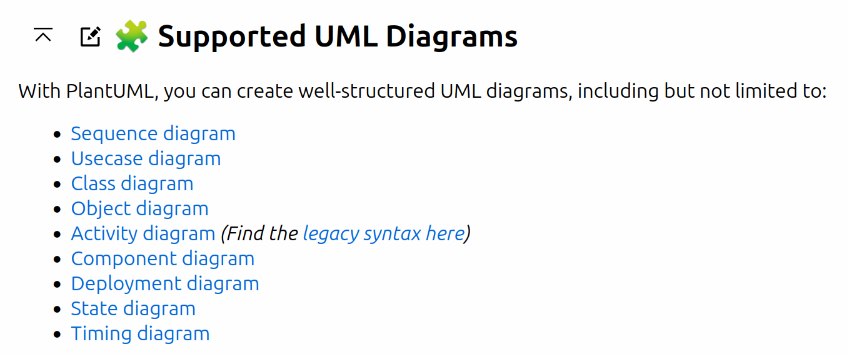

= Diagramy

Adoc supports multiple diagram types with `asciidoctor-diagram` gem, see here for syntrax (and lots of others!): https://docs.asciidoctor.org/diagram-extension/latest/diagram_types/syntrax/

include::mods/diagDitaa.adoc[]

include::mods/diagUmlet.adoc[]

WARNING: syntrax doesn't work for now - no library installed here, so just showing how it would look like in the code

----
include::mods/diagSyntrax.adoc[]
----

include::mods/diagBlock.adoc[]

== Meme extension

Perhaps I also need to enable the extension somehow or get the image? Doesn't yet work

`meme::yunoguy.jpg[Doc writers,Y U NO \\ AsciiDoc]`

== All in one: PlantUml

Way too much in one place, to the point PlantUML is installed as a separate Ruby Gem: `asciidoctor-diagram-plantuml`.
Install and usage: https://docs.asciidoctor.org/diagram-extension/latest/diagram_types/plantuml/

Tool page: https://plantuml.com/

.It supports UML of course. Credits: tool page screenshots

.But not only! Credits: tool page screenshots

== Sources

. https://asciidoctor.org/docs/asciidoctor-diagram/#creating-a-diagram
. https://asciidoctor.org/news/2014/02/18/plain-text-diagrams-in-asciidoctor/
. https://asciidoctor.org/docs/asciidoctor-diagram/#diagram-attributes
