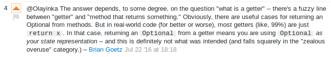

:author: Tomasz Borek
:icons: font
:source-highlighter: pygments

= Oto dokument

TIP: to dokument pokazujący potęgę Adoca

CAUTION: uważaj, nie będziesz taki sam po ujrzeniu tego dokumentu

IMPORTANT: https://docs.oracle.com/javase/7/docs/technotes/tools/windows/javadoc.html#see linki działają

== Pokazówka

[NOTE]
.to jest potęga!
[source, java]
----
include::puzzlers.java[]
----

=== Linie z numerami?

[NOTE]
.linie kodu mogą mieć atrybut inline lub table by kopiowanie działało z nimi lub bez
[source, java, linenums]
----
include::puzzlers.java[]
----

TIP: domyślnie przy podświetlaczu składni pygments jest :pygments-linenums-mode=table, co daje opcje z lub bez, zależy co zaznaczysz

=== Wyróżnienia

[source, java, linenums]
----
include::Test.java[]
----
<1> deklaracja klasy z domyślnym specifykatorem dostępu
<2> tu kod, jaki będziemy wykonywać, obecnie apka nic nie zrobi, włączy się i się zamknie
<3> tu Javadoc, dokumentacja techniczna mówiąca na co ta klasa jest i jak jej użyć

Asciidoctor :: świetny sposób na doktoryzowanie się w znaczkach Ascii. Ale można konwertować do HTMLa i PDFa i szeregu innych. 
